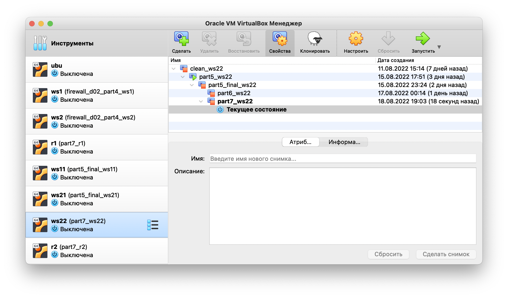

# Отчет о выполнении проекта D01 "Linux"

> Copyright (с) 2022 Student of School 21: \
> Yonn Argelia \
> yonnarge@student.21-school.ru

## Часть 1. Инструмент **ipcalc**

**== Задание ==**

##### Поднять виртуальную машину (далее -- ws1)

#### 1.1. Сети и маски
##### Определить и записать в отчёт:
##### 1) Адрес сети *192.167.38.54/13*
- Адрес сети - 192.160.0.0/13\


##### 2) Перевод маски *255.255.255.0* в префиксную и двоичную запись, */15* в обычную и двоичную, *11111111.11111111.11111111.11110000* в обычную и префиксную
- Маска *255.255.255.0* в префиксной записи - 24, в двоичной - 11111111.11111111.11111111.00000000\

- Маска */15* в обычной записи - 255.254.0.0, в двоичной - 11111111.11111110.00000000.00000000\

- Маска *11111111.11111111.11111111.11110000* в обычной записи - 255.255.255.240, в префиксной - /28\


##### 3) Минимальный и максимальный хост в сети *12.167.38.4* при масках: */8*, *11111111.11111111.00000000.00000000*, *255.255.254.0* и */4*
- Маска */8*:
    - min: 12.0.0.1
    - max: 12.255.255.254\

- Маска *11111111.11111111.00000000.00000000* (равна */16*):
    - min: 12.167.0.1
    - max: 12.167.255.254\

- Маска *255.255.254.0*:
    - min: 12.167.38.1
    - max: 12.167.39.254\

- Маска */4*:
    - min: 0.0.0.1
    - max: 15.255.255.254\


[//]: # (![]&#40;screenshots/5.png&#41;)
#### 1.2. localhost
##### Определить можно ли обратиться к приложению, работающему на localhost, со следующими IP: *194.34.23.100*, *127.0.0.2*, *127.1.0.1*, *128.0.0.1*
- Internet Protocol специфицирует сеть loopback, в IPv4 это сеть с префиксом 127.0.0.0/8 (RFC 5735), поэтому обратиться к приложению, работающем на localhost с IP 194.34.23.100 и 128.0.0.1 нельзя, тогда как с IP 127.0.0.2 и 127.1.0.1 это возможно.

#### 1.3. Диапазоны и сегменты сетей
##### Определить:
##### 1) какие из перечисленных IP можно использовать в качестве публичного, а какие только в качестве частных: *10.0.0.45*, *134.43.0.2*, *192.168.4.2*, *172.20.250.4*, *172.0.2.1*, *192.172.0.1*, *172.68.0.2*, *172.16.255.255*, *10.10.10.10*, *192.169.168.1*
- Диапазоны частных IP-адресов (RFC 1918):
  - 10.0.0.0 - 10.255.255.255
  - 172.16.0.0 - 172.31.255.255
  - 192.168.0.0 - 192.168.255.255\
  Поэтому:
  - 10.0.0.45 - Частный
  - 134.43.0.2 - Публичный
  - 192.168.4.2 - Частный
  - 172.20.250.4 - Частный
  - 172.0.2.1 - Публичный
  - 192.172.0.1 - Публичный
  - 172.68.0.2 - Публичный
  - 172.16.255.255 - Частный
  - 10.10.10.10 - Частный
  - 192.169.168.1 - Публичный

##### 2) какие из перечисленных IP адресов шлюза возможны у сети *10.10.0.0/18*: *10.0.0.1*, *10.10.0.2*, *10.10.10.10*, *10.10.100.1*, *10.10.1.255*
- Шлюзы, возможные у сети 10.10.0.0/18:
  - 10.10.0.2
  - 10.10.10.10
  - 10.10.1.255

## Часть 2. Статическая маршрутизация между двумя машинами

**== Задание ==**

##### Поднять две виртуальные машины (далее -- ws1 и ws2)

##### С помощью команды `ip a` посмотреть существующие сетевые интерфейсы
- Сетевые интерфейсы ws1:\

- Сетевые интерфейсы ws2:\


##### Описать сетевой интерфейс, соответствующий внутренней сети, на обеих машинах и задать следующие адреса и маски: ws1 - *192.168.100.10*, маска */16*, ws2 - *172.24.116.8*, маска */12*
##### Выполнить команду `netplan apply` для перезапуска сервиса сети.
- Скриншот с содержанием изменённого файла *etc/netplan/00-installer-config.yaml* для **ws1**, а также с вызовом и выводом использованной команды `netplan apply`.\
  
- Скриншот с содержанием изменённого файла *etc/netplan/00-installer-config.yaml* для **ws2**, а также с вызовом и выводом использованной команды `netplan apply`.\
  


#### 2.1. Добавление статического маршрута вручную
##### Добавить статический маршрут от одной машины до другой и обратно при помощи команды вида `ip r add`
##### Пропинговать соединение между машинами

- В настройках VirtualBox выбрал тип соединения "локальная сеть" и С помощью команды `ip r add` добавил статический маршрут от ws1 до ws2. Аналогично для ws2. Подтвердил добавление маршрута в выводе команды `route`. Подтвердил соединение машин, пропинговав поочередно обе машины.
  - ws1:\
    
  - ws2:\
    

#### 2.2. Добавление статического маршрута с сохранением
##### Перезапустить машины
##### Добавить статический маршрут от одной машины до другой с помощью файла *etc/netplan/00-installer-config.yaml*
##### Пропинговать соединение между машинами

- На скриншотах ниже показано добавление статического маршрута с помощью netplan:
  - ws1:\
    
  - ws2:\
    

## Часть 3. Утилита **iperf3**

**== Задание ==**

*В данном задании используются виртуальные машины ws1 и ws2 из Части 2*

#### 3.1. Скорость соединения
##### Перевести и записать в отчёт: 8 Mbps в MB/s, 100 MB/s в Kbps, 1 Gbps в Mbps

- 8 Mpbs = 1 MB/s
- 100 MB/s = 8 000 000 Kbps
- 1 Gbps = 1000 Mbps

#### 3.2. Утилита **iperf3**
##### Измерить скорость соединения между ws1 и ws2

- Установил ws1 в качестве сервера iperf3 командой `iperf3 -s`. Программа сообщила, что работает на порте 5201.\
  
- На машине ws2 запустил iperf3 с флагом `-с` в качестве клиента, указал адрес сервера и флагом `-p` порт, на который обратиться.\
  

## Часть 4. Сетевой экран

**== Задание ==**

*В данном задании используются виртуальные машины ws1 и ws2 из Части 2*

#### 4.1. Утилита **iptables**
##### Создать файл */etc/firewall.sh*, имитирующий фаерволл, на ws1 и ws2:
```shell
#!/bin/sh

# Удаление всех правил в таблице "filter" (по-умолчанию).
iptables –F
iptables -X
```
##### Нужно добавить в файл подряд следующие правила:
##### 1) на ws1 применить стратегию когда в начале пишется запрещающее правило, а в конце пишется разрешающее правило (это касается пунктов 4 и 5)
##### 2) на ws2 применить стратегию когда в начале пишется разрешающее правило, а в конце пишется запрещающее правило (это касается пунктов 4 и 5)
##### 3) открыть на машинах доступ для порта 22 (ssh) и порта 80 (http)
##### 4) запретить *echo reply* (машина не должна "пинговаться”, т.е. должна быть блокировка на OUTPUT)
##### 5) разрешить *echo reply* (машина должна "пинговаться")
##### Запустить файлы на обеих машинах командами `chmod +x /etc/firewall.sh` и `/etc/firewall.sh`

- Cкриншоты с содержанием файла */etc/firewall* для каждой машины:
  - ws1:\
    
  - ws2:\
    
- Скриншоты с запуском файлов на обеих машинах:
  - ws1:\
    
  - ws2:\
    
- Разница между стратегиями, применёнными в первом и втором файлах заключается в том, что приоритет имеет правило, которые было выполнено раньше, то есть первая машина будет отколонять icmp запросы, несмотря на то, что разрешающее правило было выполнено последним, приоритет у отклоняющего правила.

#### 4.2. Утилита **nmap**
##### Командой **ping** найти машину, которая не "пингуется", после чего утилитой **nmap** показать, что хост машины запущен
*Проверка: в выводе nmap должно быть сказано: `Host is up`*
- Скриншоты с вызовом и выводом команд **ping**:
  - ws1 - все пакеты от второй машины успешно пришли:\
    
  - ws2 - все пакеты от первой машины были потеряны:\
    
- Скриншоты с вызовом и выводом команд **nmap** на ws2. В выводе команды можно видеть фразу `Host is up` (третья строка):\
    
##### Сохранить дампы образов виртуальных машин
**p.s. Ни в коем случае не сохранять дампы в гит!**
- На скриншотах ниже представлены дампы виртуальных машин:  
  - ws1:\
    
  - ws2:\
    

## Часть 5. Статическая маршрутизация сети

**== Задание ==**

Сеть: \


##### Поднять пять виртуальных машин (3 рабочие станции (ws11, ws21, ws22) и 2 роутера (r1, r2))

#### 5.1. Настройка адресов машин
##### Настроить конфигурации машин в *etc/netplan/00-installer-config.yaml* согласно сети на рисунке.
##### Перезапустить сервис сети. Если ошибок нет, то командой `ip -4 a` проверить, что адрес машины задан верно. Также пропинговать ws22 с ws21. Аналогично пропинговать r1 с ws11.
- На скриншотах представлено содержание файла *etc/netplan/00-installer-config.yaml* для каждой машины, а также вывод команды `ip -4 a` после перезапуска сети:
  - ws11:\
  
  - ws21:\
  
  - ws22:\
  
  - r1:\
  
  - r2:\
  
- На следующих скриншотах показан пинг:
  - ws22 с ws21:\
    
  - r1 с ws11:\
    


#### 5.2. Включение переадресации IP-адресов.
##### Для включения переадресации IP, выполните команду на роутерах: `sysctl -w net.ipv4.ip_forward=1`.
- На скриншоте показан вызов и вывод команды `sysctl -w net.ipv4.ip_forward=1`:
  - r1:\
    
  - r2:\
    
##### Откройте файл */etc/sysctl.conf* и добавьте в него следующую строку: `net.ipv4.ip_forward = 1`.
- На скриншоте показано содержание изменённого файла */etc/sysctl.conf*:
  - r1:\
    
  - r2:\
    

#### 5.3. Установка маршрута по-умолчанию
Пример вывода команды `ip r` после добавления шлюза:
```
default via 10.10.0.1 dev eth0
10.10.0.0/18 dev eth0 proto kernel scope link src 10.10.0.2
```
##### Настроить маршрут по-умолчанию (шлюз) для рабочих станций. Для этого добавить gateway4 \[ip роутера\] в файле конфигураций
##### Вызвать `ip r` и показать, что добавился маршрут в таблицу маршрутизации
- На скриншотах представлено содержание файла *etc/netplan/00-installer-config.yaml* для рабочих станций:
  - ws11:\
    
  - ws21:\
    
  - ws22:\
    
##### Пропинговать с ws11 роутер r2 и показать на r2, что пинг доходит. Для этого использовать команду: `tcpdump -tn -i eth1`
- На скриншоте показан вызов и вывод использованных команд:
  - ws11:\
    
  - r2:\
    
- Пинг с ws11 не проходит, поскольку мы обращаемся на интерфейс недоступной подсети 10.20.0.0/26, однако `tcpdump` показывает, что поступил ARP-запрос от 10.10.0.1 (r1) для 10.10.0.2 (ws11).

#### 5.4. Добавление статических маршрутов
##### Добавить в роутеры r1 и r2 статические маршруты в файле конфигураций. Пример для r1 маршрута в сетку 10.20.0.0/26:
```shell
# Добавить в конец описания сетевого интерфейса eth1:
- to: 10.20.0.0
  via: 10.100.0.12
```
##### Вызвать `ip r` и показать таблицы с маршрутами на обоих роутерах. Пример таблицы на r1:
```
10.100.0.0/16 dev eth1 proto kernel scope link src 10.100.0.11
10.20.0.0/26 via 10.100.0.12 dev eth1
10.10.0.0/18 dev eth0 proto kernel scope link src 10.10.0.1
```
- На скриншотах представлено содержание измененного файла *etc/netplan/00-installer-config.yaml* для роутеров, а также таблицы маршрутов:
  - r1:\
    
  - r2:\
    

##### Запустить команды на ws11: `ip r list 10.10.0.0/[маска сети]` и `ip r list 0.0.0.0/0`
- Скриншоты с вызовом и выводом использованных команд:\
  
- Для адреса 10.10.0.0/[порт сети] был выбран маршрут, отличный от 0.0.0.0/0, чтобы точно указать адрес подсети. Другими словами, адрес 0.0.0.0/0 включает все хосты всех сетей и, когда пакеты отправляются хосту из подсети 10.10.0.0/18, они бы просто не доходили, так как у них точного адреса назначения. 

#### 5.5. Построение списка маршрутизаторов
Пример вывода утилиты **traceroute** после добавления шлюза:
```
1 10.10.0.1 0 ms 1 ms 0 ms
2 10.100.0.12 1 ms 0 ms 1 ms
3 10.20.0.10 12 ms 1 ms 3 ms
```
##### Запустить на r1 команду дампа: `tcpdump -tnv -i eth0`
##### При помощи утилиты **traceroute** построить список маршрутизаторов на пути от ws11 до ws21
- Скриншот с выводом команды `traceroute` на ws11:\
  
- Скриншот с вызовом команды `tcpdump` на r1. Так как вывод команды не умещается на один экран, сделал пренаправление в файл:\
  
  - Первая часть вывода `tcpdump`\
  
  - Вторая часть вывода `tcpdump`\
  
  - Третья часть вывода `tcpdump`\
  

- Принцип работы построения пути при помощи **traceroute**.\
  Первоначальный хост, с которого запускается команда, отправляет серию пакетов с ttl = 1.
  ttl - время жизни пакета, характеризующееся количеством хостов, через которое должен пройти пакет, прежде чем будет удалён.
  Первый пакет отправляется с ttl = 1, достигая первого маршрутизатора, он будет удалён, и маршрутизатор отправляет ICMP-сообщение: "time exceeded in-transit".
  Получив подобное сообщение сообщение, traceroute увеличивает ttl следующих пакетов на 1.
  traceroute отправляет пакеты на порты, которые заведомо не используются, поэтому, когда пакет достигнет адреса назначения, хост отправит сообщение типа "udp port 33440 unreachable".
  Получив подобное сообщение traceroute завершает свою работу.

#### 5.6. Использование протокола **ICMP** при маршрутизации
##### Запустить на r1 перехват сетевого трафика, проходящего через eth0 с помощью команды: `tcpdump -n -i eth0 icmp`
##### Пропинговать с ws11 несуществующий IP 
- Скриншот с вызовом и выводом указанной команды на роутере r1:\
  
- Скриншот с пингом несуществующего в подсетях проекта адреса 10.21.32.254:\
  

##### Сохранить дампы образов виртуальных машин
- Сохранил дампы образов виртуальных машин с префиксом "part5_final_":
  - ws11:\
    
  - ws21:\
    
  - ws22:\
    
  - r1:\
    
  - r2:\
    


## Часть 6. Динамическая настройка IP с помощью **DHCP**

**== Задание ==**

*В данном задании используются виртуальные машины из Части 5*

##### Для r2 настроить в файле */etc/dhcp/dhcpd.conf* конфигурацию службы **DHCP**:
##### 1) указать адрес маршрутизатора по-умолчанию, DNS-сервер и адрес внутренней сети. Пример файла для r2:
```shell
subnet 10.100.0.0 netmask 255.255.0.0 {}

subnet 10.20.0.0 netmask 255.255.255.192
{
    range 10.20.0.2 10.20.0.50;
    option routers 10.20.0.1;
    option domain-name-servers 10.20.0.1;
}
```
##### 2) в файле *resolv.conf* прописать `nameserver 8.8.8.8.`
- На скриншотах ниже представлено содержание изменённых файлов на r2:
  - dhcpd.conf:\
  
  - resolv.conf:\
  
##### Перезагрузить службу **DHCP** командой `systemctl restart isc-dhcp-server`. Машину ws21 перезагрузить при помощи `reboot` и через `ip a` показать, что она получила адрес. Также пропинговать ws22 с ws21.
- Скриншот с перезапуском службы DHCP:\
  
- На ws21 через netplan задал значение "true" для dhcp4 и убрал статический адрес.\
  
- После перезагрузки ws21 DHCP назначил машине адрес 10.10.0.26\
  
- Пинг ws22 c ws21:\
  

##### Указать MAC адрес у ws11, для этого в *etc/netplan/00-installer-config.yaml* надо добавить строки: `macaddress: 10:10:10:10:10:BA`, `dhcp4: true`
- На скриншоте ниже представлено содержание изменённого файла *etc/netplan/00-installer-config.yaml*.
  

##### Для r1 настроить аналогично r2, но сделать выдачу адресов с жесткой привязкой к MAC-адресу (ws11). Провести аналогичные тесты
- На скриншотах ниже представлено содержание изменённых файлов на r1:
  - dhcpd.conf:\
    
  - resolv.conf:\
    
- Осуществил перезапуск DHCP:\
  
- После перезагрузки ws11 ip адрес не был назначен, несмотря на то, что MAC адресс задан верно. Это можно видеть в выводе ip a на рабочей машине после перезагрузки:\
  
- Причём на роутере запросы DHCPDISCOVER от интерфейса с адресом 10:10:10:10:10:BA поступают, на что роутер даёт предложение DHCPOFFER выдать на этот интерфейс нужный адрес 10.10.0.4:\
  
- Изменил MAC адрес у ws11 в настройках VirtualBox на 10:10:10:10:10:BA:\
  
- После запуска машины все настройки слетели, так как конфиг netplan теперь стал неактуален:\
  
- Скорректировал конфиг под новый MAC адрес:\
  
- После очередной перезагрузки ws11 желаемый статичный адрес 10.10.0.4 был выдан интерфейсу eth0 с MAC адресом 10:10:10:10:10:BA:\
  
- Пропинговал с ws21 машину ws11:\
  

##### Запросить с ws21 обновление ip адреса
- ip до обновления - 10.20.0.26:
  
- вызов команды `dhclient -r eth0`, чтобы очистить адреса на интерфейсе eth0: 
  
- вызов команды `dhclient -v eth0`, чтобы запросить новый адрес от сервера: 
  
- ip после обновления - 10.20.0.27:
  

##### Сохранить дампы образов виртуальных машин
- Сохранил дампы образов виртуальных машин с префиксом "part6_":
  - ws11:\
    
  - ws21:\
    
  - ws22:\
    
  - r1:\
    
  - r2:\
    

## Часть 7. **NAT**

**== Задание ==**

*В данном задании используются виртуальные машины из Части 5*
##### В файле */etc/apache2/ports.conf* на ws22 и r1 изменить строку `Listen 80` на `Listen 0.0.0.0:80`, то есть сделать сервер Apache2 общедоступным
- На скриншотах ниже представлено содержание изменённых файлов:
  - на ws22:\
    
  - r1:\
    

##### Запустить веб-сервер Apache командой `service apache2 start` на ws22 и r1
- На скриншотах ниже представлен запуск:
  - на ws22:\
    
  - r1:\
    
##### Добавить в фаервол, созданный по аналогии с фаерволом из Части 4, на r2 следующие правила:
##### 1) Удаление правил в таблице filter - `iptables -F`
##### 2) Удаление правил в таблице "NAT" - `iptables -F -t nat`
##### 3) Отбрасывать все маршрутизируемые пакеты - `iptables --policy FORWARD DROP`
##### Запускать файл также, как в Части 4
- Создал и запустил фаервол на r2:\
  
##### Проверить соединение между ws22 и r1 командой `ping`
*При запуске файла с этими правилами, ws22 не должна "пинговаться" с r1*
- На скриншотах ниже представлен вывод команды ping:
  - с r1 до ws22:\
    
  - с ws22 до r1:\
    
##### Добавить в файл ещё одно правило:
##### 4) Разрешить маршрутизацию всех пакетов протокола **ICMP**
##### Запускать файл также, как в Части 4
- Добавил в фаервол указанное правило:\
  
##### Проверить соединение между ws22 и r1 командой `ping`
*При запуске файла с этими правилами, ws22 должна "пинговаться" с r1*
- Пинг с r1 до ws22 доходит:\
  
##### Добавить в файл ещё два правила:
##### 5) Включить **SNAT**, а именно маскирование всех локальных ip из локальной сети, находящейся за r2 (по обозначениям из Части 5 - сеть 10.20.0.0)
##### 6) Включить **DNAT** на 8080 порт машины r2 и добавить к веб-серверу Apache, запущенному на ws22, доступ извне сети
##### Запускать файл также, как в Части 4
##### Проверить соединение по TCP для **SNAT**, для этого с ws22 подключиться к серверу Apache на r1 командой:
`telnet [адрес] [порт]`
##### Проверить соединение по TCP для **DNAT**, для этого с r1 подключиться к серверу Apache на ws22 командой `telnet` (обращаться по адресу r2 и порту 8080)
- Добавил требуемые заданием правила в фаервол и проверил TCP соедиения для для SNAT и DNAT.
  

##### Сохранить дампы образов виртуальных машин
- Сохранил дампы образов виртуальных машин с префиксом "part7_":
  - ws22:\
    
  - r1:\
    
  - r2:\
    

## Часть 8. Дополнительно. Знакомство с **SSH Tunnels**

**== Задание ==**

*В данном задании используются виртуальные машины из Части 5*

##### Запустить на r2 фаервол с правилами из Части 7
##### Запустить веб-сервер **Apache** на ws22 только на localhost (то есть в файле */etc/apache2/ports.conf* изменить строку `Listen 80` на `Listen localhost:80`)
##### Воспользоваться *Local TCP forwarding* с ws21 до ws22, чтобы получить доступ к веб-серверу на ws22 с ws21
##### Воспользоваться *Remote TCP forwarding* c ws11 до ws22, чтобы получить доступ к веб-серверу на ws22 с ws11
##### Для проверки, сработало ли подключение в обоих предыдущих пунктах, перейдите во второй терминал (например, клавишами Alt + F2) и выполните команду:
`telnet 127.0.0.1 [локальный порт]`
- В отчёте описать команды, необходимые для выполнения этих четырёх пунктов, а также приложить скриншоты с их вызовом и выводом.

##### Сохранить дампы образов виртуальных машин
**p.s. Ни в коем случае не сохранять дампы в гит!**
